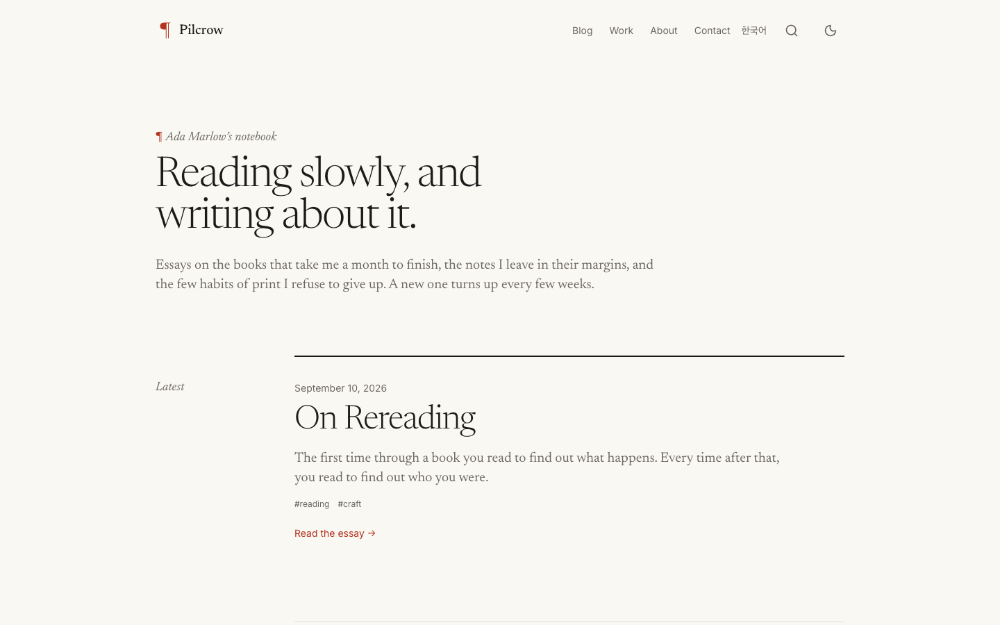

# Pilcrow

A quiet, typography-first Astro theme for writers. Good type, generous measure, nothing else in the way.

[Live demo](https://pilcrow.ondelva.com) · [Docs](https://pilcrow.ondelva.com/docs/) · [Pro version](https://buy.polar.sh/polar_cl_8dCt7ufpdKweXNgPSp3DH73SlxkMoirMTbBuF3WJooD)



## Features

- Astro 7 + Tailwind CSS v4, zero client-side JS by default
- Blog with tags (and a tag index), pagination, RSS, sitemap, JSON-LD
- Dark mode, responsive from 360px, Lighthouse 95+
- Type-safe content collections (MDX)
- `AGENTS.md`, Cursor rules, and Claude Code skills included

## Quick start

You need Node.js 22.12+ and pnpm 9 or newer (`npm i -g pnpm`). `package.json` pins the exact pnpm version, and pnpm 10+ switches to it on its own.

From GitHub, after you accept the repository invite that came with your purchase:

```sh
git clone https://github.com/ondelva/astro-theme-pilcrow-pro.git my-site
cd my-site
pnpm install
pnpm dev
```

From the zip download, unzip it, `cd` into the folder, then run `pnpm install` and `pnpm dev`.

## Configure

Edit `src/config.ts`. Everything site-specific lives there: name, URL, navigation, social links, SEO defaults.
Colors and fonts: `src/styles/global.css` (`@theme` block). See [docs/customization.md](docs/customization.md).

## Deploy

Static output. Works on Cloudflare, Vercel, Netlify. Push the site to a repository of your own first, then connect that repository to your host.
See [docs/deploy.md](docs/deploy.md).

## Free vs Pro

|               | Free                            | Pro                                                     |
| ------------- | ------------------------------- | ------------------------------------------------------- |
| Pages         | Home, About, Blog, Contact, 404 | + Pricing, Features, Team, Changelog, Legal, Newsletter |
| Home sections | 5                               | 20+                                                     |
| Search        | –                               | Pagefind                                                |
| i18n routing  | –                               | ✓                                                       |
| Color presets | 1                               | 4                                                       |
| Footer credit | One line, easy to remove        | None                                                    |
| Support       | GitHub Issues                   | Email (im@ondelva.com), 2 business days                 |

[Get Pro →](https://buy.polar.sh/polar_cl_8dCt7ufpdKweXNgPSp3DH73SlxkMoirMTbBuF3WJooD)

## License

Commercial license, see [LICENSE.md](LICENSE.md).
Third-party assets: [THIRD-PARTY-NOTICES.md](THIRD-PARTY-NOTICES.md)
